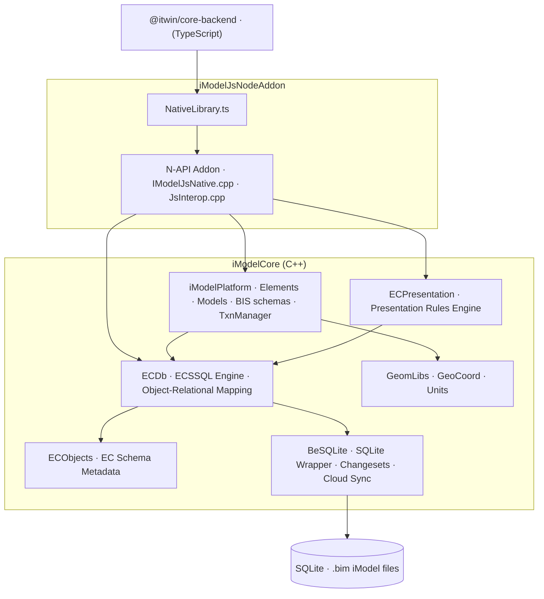

# imodel-native

[](https://www.npmjs.com/package/@bentley/imodeljs-native)
[](https://deepwiki.com/iTwin/imodel-native)

The native C++ engine powering the [iTwin.js](https://www.itwinjs.org/) platform by Bentley Systems.

This repository contains the C++ source for the `@bentley/imodeljs-native` npm package — a Node.js native addon that provides iModel file I/O, ECSQL querying, change tracking, geometry processing, and more to the `@itwin/core-backend` TypeScript layer.

## Architecture



## Modules

| Module | Location | Description |
|---|---|---|
| **BeSQLite** | `iModelCore/BeSQLite/` | Low-level SQLite wrapper. Handles changeset generation, cloud SQLite sync, and the briefcase-based ID sequence. |
| **ECObjects** | `iModelCore/ecobjects/` | EC schema system — defines the metadata model: schemas, classes, properties, relationships, and mixins. |
| **ECDb** | `iModelCore/ECDb/` | Object-relational database engine built on BeSQLite and ECObjects. Implements **ECSQL**, a SQL dialect that maps EC class/property names to physical SQLite tables. |
| **iModelPlatform** | `iModelCore/iModelPlatform/` | Business logic layer. Implements BIS schemas, Elements, Models, Views, Fonts, and `TxnManager` (changeset tracking). |
| **ECPresentation** | `iModelCore/ECPresentation/` | Presentation rules engine used by iTwin.js to drive hierarchy trees and property grids in UI. |
| **GeomLibs** | `iModelCore/GeomLibs/` | 3D geometry math: curves, surfaces, solids, polyfaces, and more. |
| **GeoCoord** | `iModelCore/GeoCoord/` | Geospatial coordinate reference system (CRS) conversion. |
| **Units** | `iModelCore/Units/` | Unit-of-measure conversion and formatting. |
| **Node Addon** | `iModelJsNodeAddon/` | N-API glue layer. Wraps all of the above and exposes them to Node.js. |
| **TypeScript API** | `iModelJsNodeAddon/api_package/ts/` | TypeScript declarations (`NativeLibrary.ts`) that form the public contract consumed by `@itwin/core-backend`. |

## Repository Structure

```
imodel-native/
├── iModelCore/              # C++ core libraries
│   ├── BeSQLite/            # SQLite wrapper
│   ├── Bentley/             # Core utilities
│   ├── ecobjects/           # EC schema system
│   ├── ECDb/                # ECSQL engine & object store
│   ├── ECPresentation/      # Presentation rules engine
│   ├── GeoCoord/            # Geospatial CRS
│   ├── GeomLibs/            # 3D geometry
│   ├── iModelPlatform/      # BIS platform layer
│   ├── Units/               # Unit conversion
│   └── libsrc/              # Third-party vendored libraries
├── iModelJsNodeAddon/       # N-API addon + TypeScript API
│   ├── api_package/ts/      # TypeScript declarations
│   ├── IModelJsNative.cpp   # Main N-API bindings
│   └── JsInterop.cpp        # Helper interop functions
└── schemas/                 # BIS schema definitions
```

## System Proxies

The imodel-native backend detects the system proxy configuration on Windows, macOS, and iOS, and it automatically uses this when doing SQLite downloads from remote servers. This includes support for Proxy Auto-Config (PAC) scripts. None of this is supported on the Linux and Android backends.

## Related Repositories

- [iTwin.js](https://github.com/iTwin/itwinjs-core) — The TypeScript platform that consumes this native package
- [iTwin Platform Docs](https://www.itwinjs.org/) — Official documentation

## License

[Apache License 2.0](./LICENSE.md) — Copyright © Bentley Systems, Incorporated. All rights reserved.
