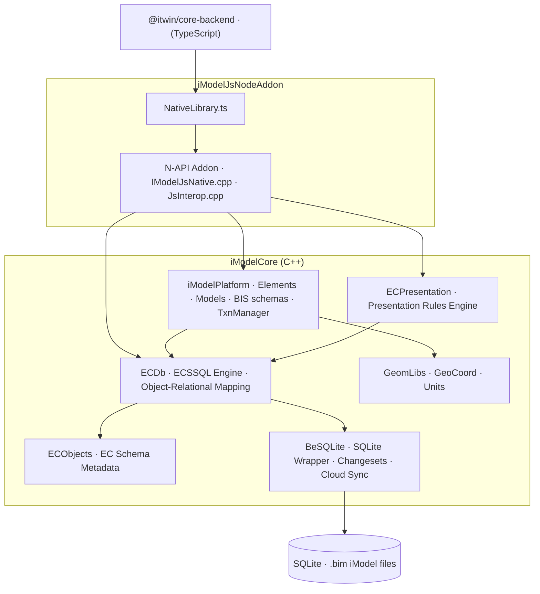

# imodel-native

[](https://www.npmjs.com/package/@bentley/imodeljs-native)
[](https://deepwiki.com/iTwin/imodel-native)

The native C++ engine powering the [iTwin.js](https://www.itwinjs.org/) platform by Bentley Systems.

This repository contains the C++ source for the `@bentley/imodeljs-native` npm package — a Node.js native addon that provides iModel file I/O, ECSQL querying, change tracking, geometry processing, and more to the `@itwin/core-backend` TypeScript layer.

## Architecture


```mermaid
graph TD
    TS["@itwin/core-backend · (TypeScript)"]

    subgraph addon ["iModelJsNodeAddon"]
        TSAPI["NativeLibrary.ts"]
        NAPI["N-API Addon · IModelJsNative.cpp · JsInterop.cpp"]
    end

    subgraph core ["iModelCore (C++)"]
        IP["iModelPlatform · Elements · Models · BIS schemas · TxnManager"]
        ECP["ECPresentation · Presentation Rules Engine"]
        ECDB["ECDb · ECSSQL Engine · Object-Relational Mapping"]
        ECO["ECObjects · EC Schema Metadata"]
        GEO["GeomLibs · GeoCoord · Units"]
        BESQL["BeSQLite · SQLite Wrapper · Changesets · Cloud Sync"]
    end

    SQLITE[("SQLite · .bim iModel files")]

    TS --> TSAPI --> NAPI
    NAPI --> IP
    NAPI --> ECP
    NAPI --> ECDB
    IP --> ECDB
    IP --> GEO
    ECP --> ECDB
    ECDB --> ECO
    ECDB --> BESQL
    BESQL --> SQLITE
```

## Modules

| Module | Location | Description |
|---|---|---|
| **BeSQLite** | `iModelCore/BeSQLite/` | Low-level SQLite wrapper. Handles changeset generation, cloud SQLite sync, and the briefcase-based ID sequence. |
| **ECObjects** | `iModelCore/ecobjects/` | EC schema system — defines the metadata model: schemas, classes, properties, relationships, and mixins. |
| **ECDb** | `iModelCore/ECDb/` | Object-relational database engine built on BeSQLite and ECObjects. Implements **ECSQL**, a SQL dialect that maps EC class/property names to physical SQLite tables. |
| **iModelPlatform** | `iModelCore/iModelPlatform/` | Business logic layer. Implements BIS schemas, Elements, Models, Views, Fonts, and `TxnManager` (changeset tracking). |
| **ECPresentation** | `iModelCore/ECPresentation/` | Presentation rules engine used by iTwin.js to drive hierarchy trees and property grids in UI. |
| **GeomLibs** | `iModelCore/GeomLibs/` | 3D geometry math: curves, surfaces, solids, polyfaces, and more. |
| **GeoCoord** | `iModelCore/GeoCoord/` | Geospatial coordinate reference system (CRS) conversion. |
| **Units** | `iModelCore/Units/` | Unit conversion and formatting. |
| **Node Addon** | `iModelJsNodeAddon/` | N-API glue layer. Wraps all of the above and exposes them to Node.js. |
| **TypeScript API** | `iModelJsNodeAddon/api_package/ts/` | TypeScript declarations (`NativeLibrary.ts`) that form the public contract consumed by `@itwin/core-backend`. |

## Repository Structure

```
imodel-native/
├── iModelCore/              # C++ core libraries
│   ├── BeSQLite/            # SQLite wrapper
│   ├── Bentley/             # Core utilities
│   ├── ecobjects/           # EC schema system
│   ├── ECDb/                # ECSQL engine & object store
│   ├── ECPresentation/      # Presentation rules engine
│   ├── GeoCoord/            # Geospatial CRS
│   ├── GeomLibs/            # 3D geometry
│   ├── iModelPlatform/      # BIS platform layer
│   ├── Units/               # Unit conversion
│   └── libsrc/              # Third-party vendored libraries
├── iModelJsNodeAddon/       # N-API addon + TypeScript API
│   ├── api_package/ts/      # TypeScript declarations
│   ├── IModelJsNative.cpp   # Main N-API bindings
│   └── JsInterop.cpp        # Helper interop functions
└── schemas/                 # BIS schema definitions
```

## Building

The build is driven by **BentleyBuild** (`bb`), an orchestrator that resolves parts across repositories. `imodel-native` does not build on its own - it needs `imodel-native-internal` (build strategies, third-party sources) checked out beside it, plus the toolchain. Getting to that first successful build is covered by the bootstrap guide on the internal wiki; this section assumes you are past it.

### Environment

`bb` reads its configuration from environment variables. The bootstrap creates `env.sh` / `env.bat` for this. Running in a shell exposes these variables:

| Variable | What it selects |
|---|---|
| `SrcRoot` | the directory holding the checked-out repositories |
| `OutRoot` | where build output goes |
| `BuildStrategy` | which parts get built. `iModelCore` for the C++ libraries and their tests; `iModelCore+iModelJsNodeAddon.Dev` to also produce the Node addon |
| `BuildArchitecture` | `LinuxX64`, `Winx64`, `MacOSARM64`, the Android and iOS variants - `bb -h` lists them all |
| `BB_PRIMARY_REPO` | `imodel-native-internal` |

### Commands

```sh
bb pull                          # update every repository in the strategy
bb build                         # incremental build of everything the strategy names
bb build --tmrbuild --noprompt   # delete the whole output tree first, then build
bb rebuild ECObjects:*test*      # force a rebuild of matching parts only
```

`--tmr` deletes the output tree without building; `--tmrbuild` deletes and then builds. `--noprompt` skips the confirmation, which is what makes either usable from a script.

Narrow a build to one product with `-p` (product), `-s` (strategy) and `-f` (part file, without the `.PartFile.xml` suffix):

```sh
bb -p ECDb-Gtest -s iModelCore -f iModelCore/ECDb/ECDb build
bb -p Units-Gtest -s iModelCore -f iModelCore/Units/Units build
```

Output lands in `$OutRoot/<BuildArchitecture>/Product/<Product>/`.

## Tests

Each module owns a GoogleTest executable, built as its own product.

| Product | Executable | Tests live in |
|---|---|---|
| `Bentley-Gtest` | `BentleyTest` | `iModelCore/Bentley/Tests/` |
| `BeSQLite-Gtest` | `BeSQLiteTest` | `iModelCore/BeSQLite/Tests/` |
| `ECObjects-Gtest` | `ECObjectsTest` | `iModelCore/ecobjects/test/` |
| `ECDb-Gtest` | `ECDbTest` | `iModelCore/ECDb/Tests/` |
| `GeomLibs-Gtest` | `GeomLibsTest` | `iModelCore/GeomLibs/geom/test/` |
| `GeoCoord-GTest` | `GeoCoordTests` | `iModelCore/GeoCoord/Tests/` |
| `Units-Gtest` | `UnitsTest` | `iModelCore/Units/tests/` |
| `ECPresentation-Gtest` | `ECPresentationTest` | `iModelCore/ECPresentation/Tests/` |
| `iModelPlatform-Gtest` | `iModelPlatformTest` | `iModelCore/iModelPlatform/Tests/DgnProject/` |

There are matching `-Performance` products for ECDb, ECObjects and iModelPlatform, a `GeoCoord-ExtensiveGTest`, and an `ECPresentation` stress product. None of them run in a normal build.

Build one and run it:

```sh
bb -p ECDb-Gtest -s iModelCore -f iModelCore/ECDb/ECDb build
$OutRoot/LinuxX64/Product/ECDb-Gtest/ECDbTest
$OutRoot/LinuxX64/Product/ECDb-Gtest/ECDbTest --gtest_filter=SchemaSyncImportTestFixture.*
```

### Ignore lists

Each suite has an `ignore_list.txt` next to its tests (`iModelCore/ECDb/Tests/ignore_list.txt` and friends), delivered to the test executable's `Assets/Ignore`. Anything named there is skipped by a plain run, with a comment saying why.

**An explicit `--gtest_filter` on the command line replaces the ignore list entirely.** That is how you run something the list excludes, and it is also why a filtered run is not the same set of tests as an unfiltered one.

The positive counterpart, `Assets/Run`, cannot be combined with `Assets/Ignore` - `BeGTestExe.cpp` builds the ignore filter and then assigns the run filter over it, discarding the first. Use `Ignore` only.

### Test tiers

Some areas are worth testing far more thoroughly than is affordable on every build. Those suites are split in two, selected by fixture name:

| Tier | Runs | How |
|---|---|---|
| core | every build | a plain run of the executable |
| extended | on demand | `--gtest_filter=*ExtendedTests.*` |

A fixture whose name ends in `ExtendedTests` is named in its suite's `ignore_list.txt`, so a plain run skips it and an explicit filter picks it up. ECDb uses this for schema sync, where the permutations of concurrent schema changes across briefcases are effectively unbounded.

A test belongs in the extended tier when it covers one more permutation of behaviour the core tier already covers. The behaviour itself stays in the core tier, however slow it is.

### iModel compatibility

`IModelEvolutionTests` (`iModelCore/iModelPlatform/Tests/DgnProject/Compatibility/`) checks that today's code still reads files written by older versions. It is deliberately outside the normal build graph - it pulls historical test runners and files from an internal NuGet feed and runs every runner against every file. It has its own build strategy, `iModelEvolutionTests`, and no scheduled pipeline.

## The Node addon

`iModelJsNodeAddon/` wraps the C++ libraries as the `@bentley/imodeljs-native` npm package. Building it needs a strategy that includes it, such as `iModelCore+iModelJsNodeAddon.Dev`.

The contract with the TypeScript side is `iModelJsNodeAddon/api_package/ts/src/NativeLibrary.ts`. A change to the C++ surface is not usable from `@itwin/core-backend` until it is declared there, so the order is: change the C++, declare it in `NativeLibrary.ts`, then write the wrapper in `core/backend`.

To test a change against a local `itwinjs-core` checkout, install the freshly built addon over the published one:

```sh
iModelJsNodeAddon/installnativeplatformLinux.sh /path/to/itwinjs-core
```

`installnativeplatform.bat` and `installnativeplatformMacOS.sh` are the equivalents.

The addon has its own TypeScript tests, which exercise paths the C++ suites structurally cannot reach - anything that needs a real `DgnDb` plus the JavaScript layer:

```sh
cd iModelJsNodeAddon/api_package/ts
npm run build && npm run pretest
npm test
```

## System Proxies

The imodel-native backend detects the system proxy configuration on Windows, macOS, and iOS, and it automatically uses this when doing SQLite downloads from remote servers. This includes support for Proxy Auto-Config (PAC) scripts. None of this is supported on the Linux and Android backends.

## Related Repositories

- [iTwin.js](https://github.com/iTwin/itwinjs-core) — The TypeScript platform that consumes this native package
- [iTwin Platform Docs](https://www.itwinjs.org/) — Official documentation

## License

[Apache License 2.0](./LICENSE.md) — Copyright © Bentley Systems, Incorporated. All rights reserved.
