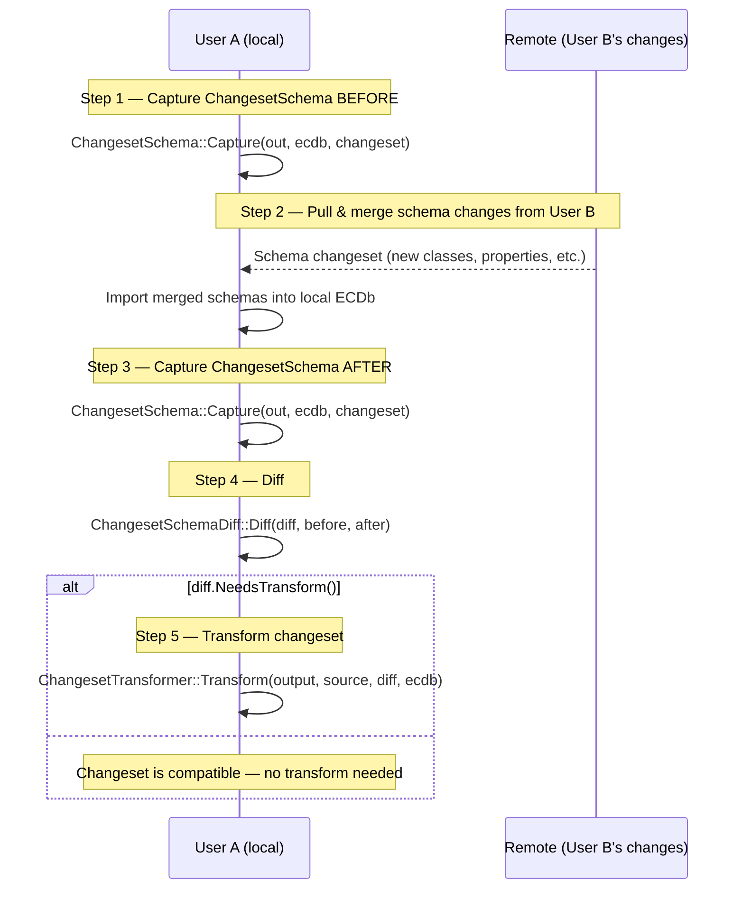
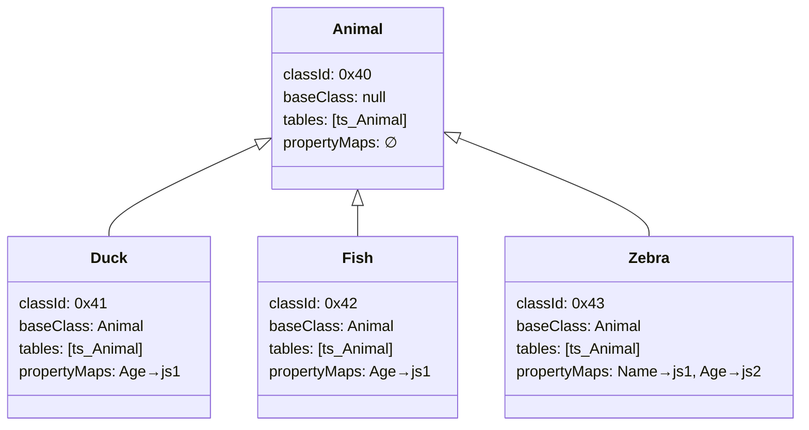
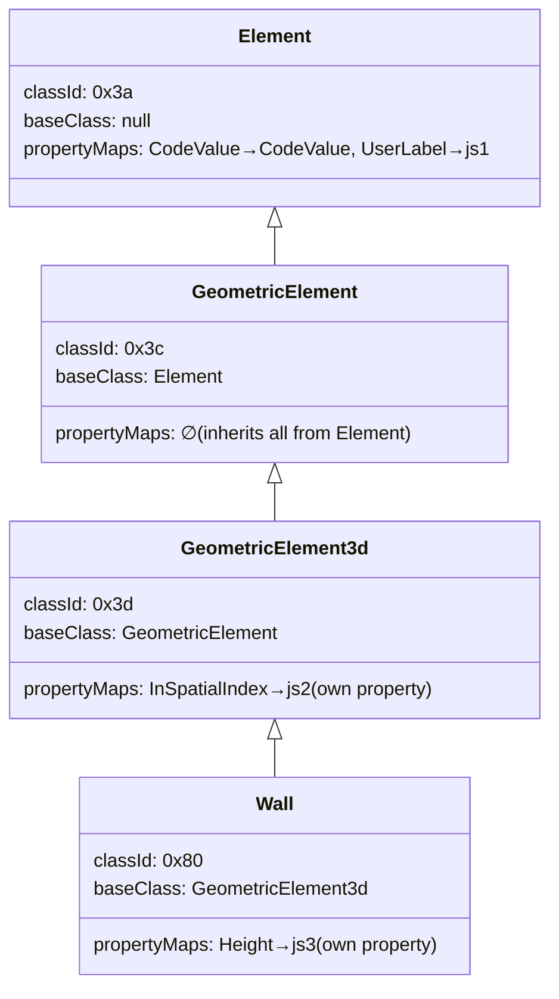
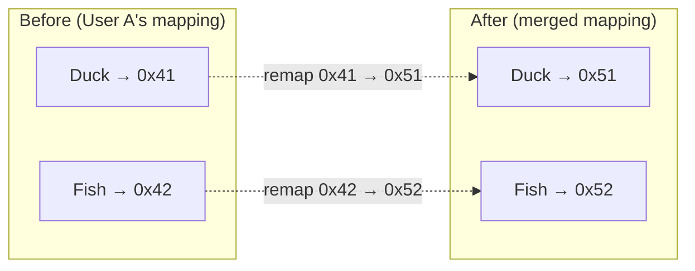
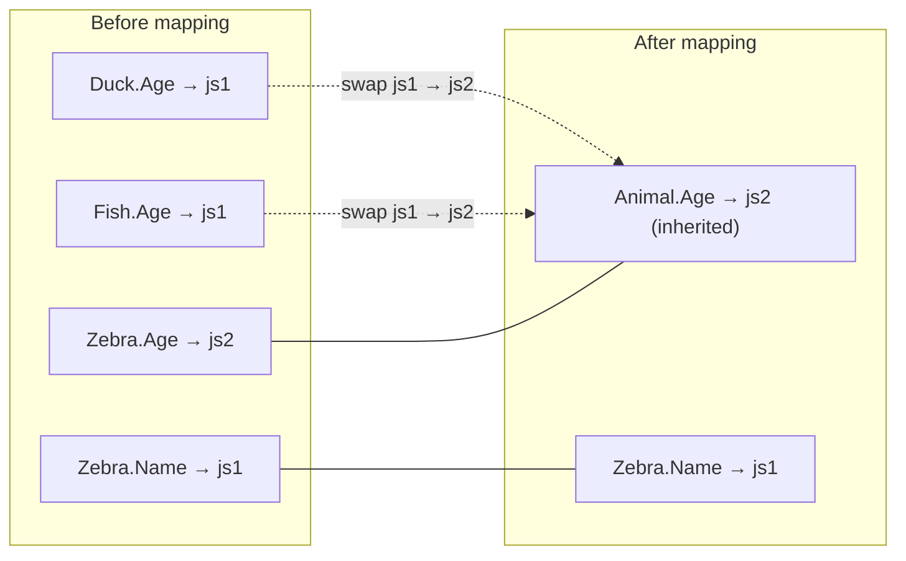
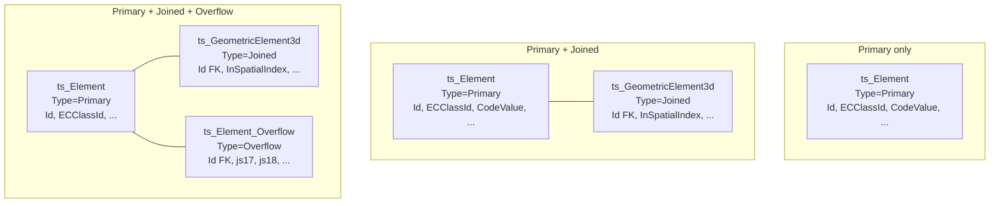
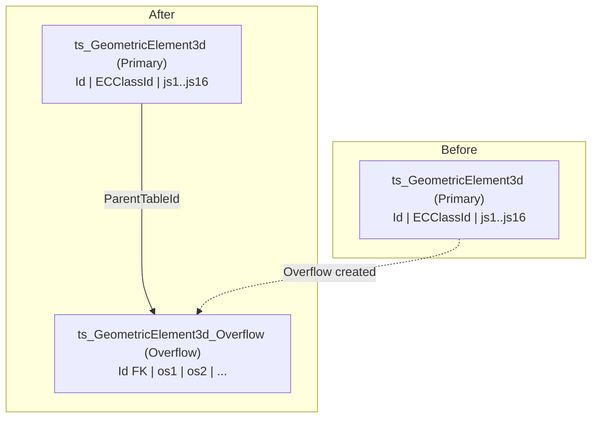
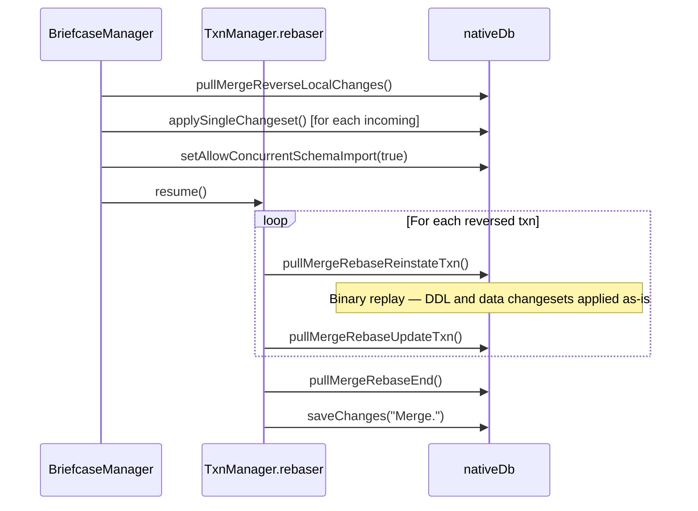

# ChangesetSchema

This document describes the `ChangesetSchema` API — a C++ class that captures the schema-to-SQLite mapping facets relevant to a changeset, serializes them to JSON, and enables diff-based detection of whether a changeset needs transformation after a schema merge.

The diagrams rely on mermaid. An extension can be used to preview these in vscode:
VS Marketplace Link: https://marketplace.visualstudio.com/items?itemName=bierner.markdown-mermaid

---

## 1. Motivation

A changeset is a binary SQLite changeset — it references **tables**, **columns**, **ECClassId** values, and **primary keys** at the SQLite level. But the mapping between EC schema concepts and SQLite is non-trivial and can change when schemas are imported by different users in different orders or with different schema versions.

When User A creates a changeset and User B later imports a schema change (adding properties, reordering classes, etc.), User A's changeset may become stale — referencing class IDs, columns, or table structures that no longer match. We need a way to:

1. **Capture** the schema mapping state when a changeset is created.
2. **Capture again** after pulling/merging another user's schema changes.
3. **Diff** the two snapshots to detect incompatibilities.
4. **Transform** the changeset if the diff reveals breaking mapping changes.

---

## 2. Workflow



### Step-by-step

| Step | Action | Description |
|------|--------|-------------|
| 1 | `ChangesetSchema::Capture(out, ecdb, changeset)` | Walk the changeset tables, extract every referenced `ECClassId`, and snapshot the current class-to-table and property-to-column mappings. Serialize to JSON. |
| 2 | Pull & merge | Another user's schema changes are applied to the local ECDb (schema import). This may alter `ec_ClassMap`, `ec_PropertyMap`, `ec_Table`, `ec_Column`. |
| 3 | `ChangesetSchema::Capture(out, ecdb, changeset)` | Capture the same changeset against the **updated** ECDb. The changeset bytes haven't changed, but the mapping metadata may have. |
| 4 | `ChangesetSchemaDiff::Diff(diff, before, after)` | Compare the two JSON snapshots. Produce a diff that identifies remapped class IDs, swapped columns, and new overflow tables. |
| 5 | `ChangesetTransformer::Transform(output, source, diff, ecdb)` | Rewrite the changeset binary: remap class IDs, move column values, insert overflow rows. |

---

## 3. What to Capture

A changeset operates on SQLite tables. Each table in the changeset maps to one or more EC classes via `ec_ClassMap`. For each row in the changeset, we know the table name (from the changeset header) and can read the ECClassId column value (if present) to identify the exact class.

We capture:

| Facet | Why |
|-------|-----|
| **ECClassId** for each `{schemaName, className}` | Detect class ID remapping when same class is imported in different order |
| **Property-to-column mapping** (`accessString` → `{table, column}`) | Detect column swaps when shared columns are reassigned |
| **Table set** per class (primary, joined, overflow) | Detect when overflow table is created for a class that previously didn't have one |
| **Class hierarchy** (base class reference) | Enable property map inheritance to reduce JSON duplication |

### What NOT to capture

- **`SourceECClassId`**, **`TargetECClassId`**, **`RelClassId`** column property maps are excluded from the property mapping — these are system constraint columns on relationship link tables that reference the *endpoint* classes, not the row's own class. They do **not** need column-swap tracking.
  - **Exception**: If a class *also* appears as an instance row (i.e., the `ECClassId` of the row itself), then its own `ECClassId` mapping is captured normally. The exclusion only applies to the constraint-specific columns (`SourceECClassId`, `TargetECClassId`, `RelECClassId`) in their role as property maps.

---

## 4. JSON Format

### 4.1 Top-level structure

```jsonc
{
  "version": "1.0",
  // Only classes that appear in the changeset (via ECClassId column values or
  // exclusive-root-class tables) and their ancestor chain up to the root.
  "classes": {
    "<schemaName>:<className>": { /* ClassEntry */ },
    ...
  }
}
```

### 4.2 ClassEntry

```jsonc
{
  // The ECClassId assigned to this class in ec_Class
  "classId": "0x3a",

  // Fully qualified base class key (null for root mapped class).
  // Enables property map inheritance — consumer walks up the chain
  // to collect the full property map.
  "baseClass": "<schemaName>:<className>" | null,

  // The set of tables this class maps to, keyed by table name.
  // Only includes tables that have at least one column mapped to this class.
  "tables": {
    "<tableName>": {
      // DbTable::Type  (0=Primary, 1=Joined, 3=Overflow)
      "type": "Primary" | "Joined" | "Overflow"
    },
    ...
  },

  // Property-to-column mappings LOCAL to this class (not inherited).
  // Parent class property maps are inherited via "baseClass" and not repeated.
  // Key is the AccessString (e.g., "Age", "Address.Street", "Geom.Origin.X").
  "propertyMaps": {
    "<accessString>": {
      "table": "<tableName>",
      "column": "<columnName>"
    },
    ...
  }
}
```

### 4.3 Inheritance optimization

Property maps follow the same inheritance rule as the EC class hierarchy and `ec_PropertyMap`: a child class inherits all property maps from its parent. The JSON only stores the **delta** — properties defined or first-mapped at that class level.

To reconstruct the full property map for a class, walk `baseClass` up to `null` and merge all `propertyMaps` objects (child overrides parent on conflict).



**JSON for this example:**

```json
{
  "version": "1.0",
  "classes": {
    "TestSchema:Animal": {
      "classId": "0x40",
      "baseClass": null,
      "tables": {
        "ts_Animal": { "type": "Primary" }
      },
      "propertyMaps": {}
    },
    "TestSchema:Duck": {
      "classId": "0x41",
      "baseClass": "TestSchema:Animal",
      "tables": {
        "ts_Animal": { "type": "Primary" }
      },
      "propertyMaps": {
        "Age": { "table": "ts_Animal", "column": "js1" }
      }
    },
    "TestSchema:Fish": {
      "classId": "0x42",
      "baseClass": "TestSchema:Animal",
      "tables": {
        "ts_Animal": { "type": "Primary" }
      },
      "propertyMaps": {
        "Age": { "table": "ts_Animal", "column": "js1" }
      }
    },
    "TestSchema:Zebra": {
      "classId": "0x43",
      "baseClass": "TestSchema:Animal",
      "tables": {
        "ts_Animal": { "type": "Primary" }
      },
      "propertyMaps": {
        "Name": { "table": "ts_Animal", "column": "js1" },
        "Age":  { "table": "ts_Animal", "column": "js2" }
      }
    }
  }
}
```

> **Note**: `Duck` and `Fish` both map `Age` → `js1` independently — they share the physical column but each has its own `ec_PropertyMap` entry. `Zebra` maps `Name` → `js1` and `Age` → `js2` because its properties were assigned to different shared columns. In this flat hierarchy where `Animal` has no properties, there is nothing to inherit — each leaf defines its own `propertyMaps`.

### 4.4 Inheritance optimization with deep hierarchy

When a base class defines properties, all derived classes inherit those mappings without repeating them:



To get Wall's full property map:
- Walk up: Wall → GeometricElement3d → GeometricElement → Element
- Merge: `{CodeValue→CodeValue, UserLabel→js1, InSpatialIndex→js2, Height→js3}`

---

## 5. Diff Algorithm

Given `before` and `after` ChangesetSchema JSON, produce a `ChangesetSchemaDiff`:

```
For each class key K in before.classes:
    Let B = before.classes[K]
    Let A = after.classes[K]     // same schemaName:className

    ERROR — CLASS NOT FOUND:
        If K does not exist in after.classes → FAIL.
        Schema changes are additive; a class present in the "before" snapshot must
        still exist after a pull-merge. If it is missing, this indicates a code error
        in schema import or capture logic.
        Report: "Class '{K}' present in changeset schema before pull-merge was not
                 found after pull-merge. This is unexpected — schema changes should
                 be additive."

    1. CLASS ID REMAP:  if B.classId ≠ A.classId → record remap(K, B.classId, A.classId)

    2. COLUMN SWAP:     for each accessString S in fullPropertyMap(B):
                            Let colB = fullPropertyMap(B)[S]  // {table, column}
                            Let colA = fullPropertyMap(A)[S]

                            ERROR — PROPERTY NOT FOUND:
                                If S does not exist in fullPropertyMap(A) → FAIL.
                                A property mapped before pull-merge must still be
                                mapped after. A missing access string means the
                                property was dropped or its mapping was lost, which
                                should never happen with additive schema changes.
                                Report: "Property '{S}' of class '{K}' present in
                                         changeset schema before pull-merge has no
                                         mapping after pull-merge. This is unexpected
                                         — schema changes should be additive."

                            if colB ≠ colA → record columnSwap(K, S, colB, colA)

    3. OVERFLOW TABLE:  Let tablesB = set of table names in B.tables
                        Let tablesA = set of table names in A.tables

                        ERROR — TABLE DISAPPEARED:
                            For each table T in (tablesB \ tablesA):
                                → FAIL. A table present before must still exist after.
                                Report: "Table '{T}' for class '{K}' present in
                                         changeset schema before pull-merge was not
                                         found after pull-merge. This is unexpected
                                         — schema changes should be additive."

                        for each table T in (tablesA \ tablesB):
                            if A.tables[T].type == "Overflow"
                                → record overflowAdded(K, T)
```

Where `fullPropertyMap(entry)` resolves inheritance by walking `baseClass` up to root and merging all `propertyMaps`.

> **On failure behavior**: All three error conditions above (missing class, missing property, disappeared table) should **never** occur in production — ECDb schema changes are strictly additive. These checks exist as defensive assertions to catch code errors in `Capture`, schema import, or `Diff` logic. When triggered, the `Diff` method returns `ERROR` and logs a detailed diagnostic message via `IssueDataSource` identifying exactly which class/property/table was unexpectedly missing.

---

## 6. Transform Cases

### 6.1 Case 1 — ECClassId Remap

**When it happens**: Two users independently import the same schema (or overlapping schemas). Because `ec_Class.Id` is assigned sequentially during import, the same class can get different IDs depending on import order.

**What to do**: In every changeset row where the `ECClassId` column (or any column storing a class ID reference) contains the old value, replace it with the new value.

#### Example

User A imports `TestSchema` and gets:

| Class | ECClassId |
|-------|-----------|
| `Animal` | `0x40` |
| `Duck` | `0x41` |
| `Fish` | `0x42` |

User B imports `AnotherSchema` first, then `TestSchema`, and gets:

| Class | ECClassId |
|-------|-----------|
| `Animal` | `0x50` |
| `Duck` | `0x51` |
| `Fish` | `0x52` |

User A's changeset contains rows with `ECClassId = 0x41` (Duck). After merging User B's schemas, Duck is now `0x51`.



**Diff output:**
```json
{
  "classIdRemaps": [
    { "class": "TestSchema:Duck",   "oldClassId": "0x41", "newClassId": "0x51" },
    { "class": "TestSchema:Fish",   "oldClassId": "0x42", "newClassId": "0x52" }
  ]
}
```

**Transform action**: For each row in the changeset whose table has an `ECClassId` column, if the old or new value matches an `oldClassId`, replace it with the corresponding `newClassId`. This applies to:
- The `ECClassId` column on entity/relationship primary tables
- Any system column storing a class reference (e.g., `ECClassId` on joined tables)

> **Note on SourceECClassId / TargetECClassId / RelClassId**: These columns on relationship link tables store the class IDs of the *endpoint* instances. If those endpoint classes were also remapped, the values in these columns must also be updated using the same remap table. The class ID remap is applied globally to all columns whose `DbColumn::Kind` is `ECClassId` (value `2`).

---

### 6.2 Case 2 — Column Swap (AccessString Remapping)

**When it happens**: Shared columns are used in `TablePerHierarchy` mapping. When a schema change causes properties to be remapped to different shared columns (e.g., a property is moved up the hierarchy, a new base class is inserted, or properties are added/deleted), the mapping from `accessString` to physical column can change.

This is handled today during schema import by `RemapManager` for the local database. But for a **remote changeset** created against the old mapping, we need to detect the column changes and move values within the changeset.

#### Example: "Move property up" scenario

**Before** — `Animal` has no properties; `Duck.Age` and `Fish.Age` map to shared column `js1`; `Zebra.Name` → `js1`, `Zebra.Age` → `js2`:

```
┌─────────────────────────────────────────────┐
│              ts_Animal (Primary)            │
├────────┬───────────┬─────────┬──────────────┤
│   Id   │ ECClassId │  js1    │     js2      │
├────────┼───────────┼─────────┼──────────────┤
│  101   │  Duck     │ Age=5   │   (null)     │
│  102   │  Fish     │ Age=3   │   (null)     │
│  103   │  Zebra    │ Name=Z  │   Age=10     │
└────────┴───────────┴─────────┴──────────────┘

Property map (before):
  Duck.Age   → ts_Animal:js1
  Fish.Age   → ts_Animal:js1
  Zebra.Name → ts_Animal:js1
  Zebra.Age  → ts_Animal:js2
```

**After** — `Age` is moved up to `Animal` (all derived classes inherit it). Remapper reassigns columns:

```
┌─────────────────────────────────────────────┐
│              ts_Animal (Primary)            │
├────────┬───────────┬──────────┬─────────────┤
│   Id   │ ECClassId │  js1     │     js2     │
├────────┼───────────┼──────────┼─────────────┤
│  101   │  Duck     │ (null)   │   Age=5     │
│  102   │  Fish     │ (null)   │   Age=3     │
│  103   │  Zebra    │ Name=Z   │   Age=10    │
└────────┴───────────┴──────────┴─────────────┘

Property map (after):
  Animal.Age → ts_Animal:js2   (inherited by all)
  Zebra.Name → ts_Animal:js1
```



**Diff output:**
```json
{
  "columnSwaps": [
    {
      "class": "TestSchema:Duck",
      "accessString": "Age",
      "old": { "table": "ts_Animal", "column": "js1" },
      "new": { "table": "ts_Animal", "column": "js2" }
    },
    {
      "class": "TestSchema:Fish",
      "accessString": "Age",
      "old": { "table": "ts_Animal", "column": "js1" },
      "new": { "table": "ts_Animal", "column": "js2" }
    }
  ]
}
```

> **Note**: Zebra's mappings didn't change (`Name` stays on `js1`, `Age` stays on `js2`), so it doesn't appear in the diff.

**Transform action**: For each changeset row affecting `ts_Animal` where `ECClassId` matches `Duck` or `Fish`:
- Read the value from the old column position (`js1`)
- Write it to the new column position (`js2`)
- Clear the old column position

> **Caution**: Column swaps can be **circular** (e.g., `js1 → js2` and `js2 → js1`). The transform must handle circular swaps within the same table using temporary storage, just as `RemapManager::SortCircularRemappedColumnInfos` does today for the live database. Cross-table swaps require moving data via a temporary buffer.

#### Column swaps may span table segments

When a class maps to multiple tables (primary + joined), a column can move from the primary table to the joined table or vice versa. The diff captures `{table, column}` pairs, so cross-table moves are naturally represented:

```json
{
  "class": "TestSchema:SpecialDuck",
  "accessString": "Wingspan",
  "old": { "table": "ts_Animal",   "column": "js3" },
  "new": { "table": "ts_SpecialDuck", "column": "Wingspan" }
}
```

---

### 6.3 Case 3 — Overflow Table Creation

**When it happens**: A `TablePerHierarchy` class has a `MaxSharedColumnsBeforeOverflow` limit. When a schema change adds enough new properties to exceed this limit, an **overflow table** is created during schema import. Instances of classes that now map properties to the overflow table must have a corresponding row there.

For a **local** database this is handled during schema import (see `SchemaManagerDispatcher` inserting empty overflow rows). But for a **remote changeset**, if the changeset contains INSERT operations for instances of a class that *now* has an overflow table but *previously didn't*, we must add an INSERT for the overflow table row as well.

#### Which classes need overflow rows?

Not all derived classes map to the overflow table. Only classes that have **at least one property mapped to the overflow table** need rows there. The `propertyMaps` in the ChangesetSchema tell us which classes have columns in the overflow table.

#### Table hierarchy types



#### Example

**Before**: `Building` class maps to `ts_GeometricElement3d` (primary) with shared columns `js1`..`js16`. No overflow table exists.

```
Property map (before):
  Building.Height    → ts_GeometricElement3d : js5
  Building.Width     → ts_GeometricElement3d : js6
  Building.Material  → ts_GeometricElement3d : js7
```

**After**: User B adds 20 new properties to `Building`'s parent class. This exceeds `MaxSharedColumnsBeforeOverflow = 16`, and an overflow table `ts_GeometricElement3d_Overflow` is created. Some of Building's properties are now mapped to overflow:

```
Property map (after):
  Building.Height    → ts_GeometricElement3d : js5          (unchanged)
  Building.Width     → ts_GeometricElement3d : js6          (unchanged)
  Building.Material  → ts_GeometricElement3d_Overflow : os1 (moved to overflow!)
  Building.NewProp1  → ts_GeometricElement3d_Overflow : os2 (new property)
```



**Diff output:**
```json
{
  "overflowTablesAdded": [
    {
      "class": "TestSchema:Building",
      "overflowTable": "ts_GeometricElement3d_Overflow",
      "parentTable": "ts_GeometricElement3d",
      "hasECClassIdColumn": false
    }
  ]
}
```

**Transform action**: For each INSERT in the changeset for table `ts_GeometricElement3d` where the row's `ECClassId` matches `Building` (or a derived class that maps to the overflow):
1. Extract the `ECInstanceId` (primary key) from the changeset row.
2. Create a new INSERT change for `ts_GeometricElement3d_Overflow` with:
   - Same `ECInstanceId` as the primary table row
   - `ECClassId` if the overflow table has one (check `hasECClassIdColumn`)
   - All other columns as `NULL` (empty row — actual property values will come from future changesets or are already in the correct column via column-swap transform)
3. Append this INSERT to the changeset.

> **Note**: The overflow row is needed even though all overflow columns may be NULL for this instance — the foreign key relationship requires a row to exist for every instance that has a corresponding primary/joined row, *if* the class maps any property to that overflow table.

---

## 7. C++ API

Source files:
- `iModelCore/ECDb/PublicAPI/ECDb/ChangesetSchema.h` — public header
- `iModelCore/ECDb/ECDb/ChangesetSchema.cpp` — `Capture`, `CaptureFromDb`, `ToJson`, `FromJson`, `GetFullPropertyMap`, `ChangesetSchemaDiff::Diff`, `ChangesetSchemaDiff::ToJson`
- `iModelCore/ECDb/ECDb/ChangesetTransformer.cpp` — `ChangesetTransformer::Transform`

### 7.1 ChangesetSchemaClassEntry

```cpp
struct ChangesetSchemaPropertyMap final
    {
    Utf8String m_table;
    Utf8String m_column;
    bool operator==(ChangesetSchemaPropertyMap const& rhs) const;
    bool operator!=(ChangesetSchemaPropertyMap const& rhs) const;
    };

struct ChangesetSchemaTableInfo final
    {
    Utf8String m_type; // "Primary", "Joined", or "Overflow"
    };

struct ChangesetSchemaClassEntry final
    {
    Utf8String m_classKey;  // "SchemaName:ClassName"
    ECClassId  m_classId;
    Utf8String m_baseClass; // empty if root mapped class

    std::map<Utf8String, ChangesetSchemaTableInfo>   m_tables;
    std::map<Utf8String, ChangesetSchemaPropertyMap> m_propertyMaps;
    };
```

### 7.2 ChangesetSchema class

```cpp
struct ChangesetSchema final
    {
    //! Capture the schema mapping state for only classes referenced by the given changeset.
    //! Iterates the changeset to find all referenced tables, reads ECClassId values
    //! from changeset rows, then queries ec_ClassMap, ec_PropertyMap, ec_PropertyPath,
    //! ec_Table, ec_Column to build the mapping snapshot for those classes and their
    //! inheritance chain only.
    static BentleyStatus Capture(ChangesetSchema& out, ECDbCR ecdb,
                                 BeSQLite::ChangeStream const& changeset);

    //! Capture the schema mapping state for ALL mapped classes in the ECDb.
    //! Useful for testing or when you want a complete snapshot regardless of
    //! which changeset it will be used with.
    static BentleyStatus CaptureFromDb(ChangesetSchema& out, ECDbCR ecdb);

    //! Serialize to JSON.
    void ToJson(BeJsValue out) const;

    //! Deserialize from JSON.
    static BentleyStatus FromJson(ChangesetSchema& out, BeJsConst json);

    //! Resolve the full property map for a class by walking the inheritance chain.
    //! Returns a merged map from root to the given class (child overrides parent on conflict).
    std::map<Utf8String, ChangesetSchemaPropertyMap> GetFullPropertyMap(Utf8StringCR classKey) const;

    std::map<Utf8String, ChangesetSchemaClassEntry> const& GetClasses() const;
    std::map<Utf8String, ChangesetSchemaClassEntry>&       GetClassesR();
    };
```

### 7.3 ChangesetSchemaDiff class

```cpp
struct ChangesetSchemaDiff final
    {
    struct ClassIdRemap
        {
        Utf8String m_classKey;      // "SchemaName:ClassName"
        ECClassId  m_oldClassId;
        ECClassId  m_newClassId;
        };

    struct ColumnSwap
        {
        Utf8String m_classKey;
        Utf8String m_accessString;
        Utf8String m_oldTable;
        Utf8String m_oldColumn;
        Utf8String m_newTable;
        Utf8String m_newColumn;
        };

    struct OverflowTableAdded
        {
        Utf8String m_classKey;
        Utf8String m_overflowTable;
        Utf8String m_parentTable;
        bool       m_hasECClassIdColumn;
        };

    // Exceptional case: a class, property, or table present in the "before" snapshot
    // was not found in the "after" snapshot. Should never occur with additive schema changes.
    struct MissingMapping
        {
        enum class Kind { Class, Property, Table };
        Kind       m_kind;
        Utf8String m_classKey;        // always set
        Utf8String m_accessString;    // set when Kind == Property
        Utf8String m_tableName;       // set when Kind == Table
        Utf8String m_message;
        };

    bvector<ClassIdRemap>       m_classIdRemaps;
    bvector<ColumnSwap>         m_columnSwaps;
    bvector<OverflowTableAdded> m_overflowTablesAdded;
    bvector<MissingMapping>     m_errors;

    // Returns true if any transform is needed and no errors were detected.
    bool NeedsTransform() const;

    // Returns true if the diff detected missing classes, properties, or tables.
    // When true, the changeset MUST NOT be transformed.
    bool HasErrors() const;

    // Serialize diff to JSON (for diagnostics / logging). Includes errors if any.
    void ToJson(BeJsValue out) const;

    // Diff two snapshots. Returns the set of transforms needed.
    // Errors (missing classes/properties/tables) are collected in m_errors rather
    // than returning ERROR immediately — call HasErrors() before transforming.
    static BentleyStatus Diff(ChangesetSchemaDiff& out,
                              ChangesetSchema const& before,
                              ChangesetSchema const& after);
    };
```

### 7.4 ChangesetTransformer class

```cpp
struct ChangesetTransformer final
    {
    //! Apply all transforms from the diff to the source changeset.
    //! Produces a new transformed changeset in 'output' — the source is not modified.
    //! Returns ERROR immediately if diff.HasErrors().
    //! If !diff.NeedsTransform(), the source is copied to output unchanged.
    static BentleyStatus Transform(BeSQLite::ChangeSet& output,
                                   BeSQLite::ChangeStream const& source,
                                   ChangesetSchemaDiff const& diff,
                                   ECDbCR ecdb);
    };
```

**Transform algorithm**:

1. **Early exit**: If `diff.HasErrors()` → return ERROR. If `!diff.NeedsTransform()` → copy source to output.
2. **Build lookup tables**:
   - Class ID remap: `map<uint64_t oldId, uint64_t newId>`
   - Per-table ECClassId column ordinals (from `ec_Column` where `ColumnKind = 2`, plus `SourceECClassId`/`TargetECClassId` by name)
   - Per-table column name → ordinal mapping (for resolving swap targets)
   - Per-class per-table `TableRemap`: same-table swaps (`srcOrd → dstOrd`), cross-table moves (`srcOrd → {overflowTable, dstOrd}`), plus precomputed reverse maps (`dstToSrc`, `crossTableSrcOrds`)
3. **Iterate source changes** using `ChangeBuilder`:
   - For each change, read the table name and determine ECClassId from the row.
   - **Class ID remap**: For all ECClassId-kind columns (ECClassId, SourceECClassId, TargetECClassId), replace old values with new values from the remap map.
   - **Column swap (INSERT/DELETE)**: Iterate by destination ordinal. For each dstOrd:
     - If `dstToSrc[dstOrd]` exists → read from the source ordinal indicated.
     - Else if `dstOrd` is a same-table swap source or cross-table move source → write NULL (value moved away).
     - Else if `srcOrd >= nCols` (new column) → write NULL.
     - Otherwise → identity (read from same ordinal).
   - **Column swap (UPDATE)**: Iterate by source ordinal. For each srcOrd:
     - Skip unchanged columns (both old/new undefined).
     - Skip cross-table move sources (handled in overflow row).
     - Apply same-table swap to determine dstOrd.
     - Skip if srcOrd is claimed as destination by another swap (displaced, no explicit remap).
     - Write old/new values only if defined (undefined = "unchanged" in changeset format).
   - **Overflow rows**: For cross-table moves, generate a synthetic row per overflow table:
     - INSERT: `new.PK`, `new.ECClassId` (if present), moved column values, NULL for other columns.
     - DELETE: `old.PK`, `old.ECClassId` (if present), moved column values, NULL for other columns.
     - UPDATE: `old.PK` only (PK identifies row, doesn't change). ECClassId left unbound (unchanged). Moved columns bind old/new only if defined. Other columns left unbound (unchanged marker in changeset format).
4. **Write to output**: Serialize the `ChangeBuilder` to the output `ChangeSet` via `FromChangeBuilder`.

---

## 8. Capture — What Gets Included

The `Capture` method (changeset-scoped) iterates all changes in the changeset and builds the class set. The `CaptureFromDb` method captures all mapped classes regardless of the changeset — use it for testing or when you want a full snapshot.

### 8.1 `Capture(out, ecdb, changeset)` — Changeset-Scoped Algorithm

```
For each change in changeset:
    tableName = change.GetTableName()

    Look up tableName in ec_Table:
        If table has ExclusiveRootECClassId → add that class
        Else if table has ECClassId column →
            Read ECClassId value from changeset row (old or new value) → add that class

    For each added class:
        Walk up the class hierarchy (ec_ClassHasBaseClasses) to the root mapped class
        For each class in the chain:
            Add to output if not already present
            Query ec_PropertyMap + ec_PropertyPath + ec_Column for property mappings
            Query ec_ClassMap for table set
            Determine baseClass for inheritance chain
```

**Filtering**: Only classes that actually appear as instance rows in the changeset (or their ancestor chain) are included. This keeps the JSON small and focused on what's needed for transform.

### 8.2 `CaptureFromDb(out, ecdb)` — Full Database Snapshot

Captures ALL mapped classes (those with a non-zero MapStrategy in `ec_ClassMap`), their full inheritance chains, table sets, and property maps. No changeset filtering is applied.

---

## 9. Full Diff JSON Example

Combining all three transform cases:

```json
{
  "classIdRemaps": [
    {
      "class": "TestSchema:Duck",
      "oldClassId": "0x41",
      "newClassId": "0x51"
    },
    {
      "class": "TestSchema:Fish",
      "oldClassId": "0x42",
      "newClassId": "0x52"
    }
  ],
  "columnSwaps": [
    {
      "class": "TestSchema:Duck",
      "accessString": "Age",
      "old": { "table": "ts_Animal", "column": "js1" },
      "new": { "table": "ts_Animal", "column": "js2" }
    },
    {
      "class": "TestSchema:Fish",
      "accessString": "Age",
      "old": { "table": "ts_Animal", "column": "js1" },
      "new": { "table": "ts_Animal", "column": "js2" }
    }
  ],
  "overflowTablesAdded": [
    {
      "class": "TestSchema:Building",
      "overflowTable": "ts_GeometricElement3d_Overflow",
      "parentTable": "ts_GeometricElement3d",
      "hasECClassIdColumn": false
    }
  ]
}
```

---

## 10. Edge Cases & Notes

### Error conditions (defensive checks)

Schema changes in ECDb are **strictly additive** — classes are never deleted, properties are never removed (only overrides are deleted, the root definition persists), and tables are never dropped. This means that every class, property, and table present in a "before" ChangesetSchema must also appear in the "after" snapshot.

The following error conditions should **never occur in production**. They exist to catch bugs in `Capture`, schema import, or mapping logic:

| Error | Condition | Likely cause |
|-------|-----------|--------------|
| **Class not found** | A class key `"Schema:Class"` exists in `before.classes` but not in `after.classes` | Bug in `Capture` — class was not picked up from the updated ECDb, or schema import incorrectly dropped a class |
| **Property not found** | An `accessString` exists in `fullPropertyMap(before)` for a class but not in `fullPropertyMap(after)` | Bug in schema import — a property mapping was lost during remap, or `Capture` failed to walk the inheritance chain |
| **Table disappeared** | A table name exists in `before.classes[K].tables` but not in `after.classes[K].tables` | Bug in schema import — a table was unexpectedly dropped or the class-to-table mapping was lost |

**Error JSON** (included in diff output when errors are present):

```json
{
  "errors": [
    {
      "kind": "Class",
      "classKey": "TestSchema:Flamingo",
      "message": "Class 'TestSchema:Flamingo' present in changeset schema before pull-merge was not found after pull-merge. Schema changes are additive — this indicates a code error."
    },
    {
      "kind": "Property",
      "classKey": "TestSchema:Duck",
      "accessString": "Wingspan",
      "message": "Property 'Wingspan' of class 'TestSchema:Duck' present in changeset schema before pull-merge has no mapping after pull-merge. Schema changes are additive — this indicates a code error."
    },
    {
      "kind": "Table",
      "classKey": "TestSchema:Fish",
      "tableName": "ts_FishData",
      "message": "Table 'ts_FishData' for class 'TestSchema:Fish' present in changeset schema before pull-merge was not found after pull-merge. Schema changes are additive — this indicates a code error."
    }
  ],
  "classIdRemaps": [],
  "columnSwaps": [],
  "overflowTablesAdded": []
}
```

When `errors` is non-empty:
1. `NeedsTransform()` returns `false` — we refuse to transform a changeset against inconsistent mappings.
2. `Transform()` returns `ERROR` immediately without modifying the changeset.
3. The caller should log all errors (the `ToJson` output includes them) and surface them to the user as a diagnostic. The message explicitly states this is a code error, not a user error.

### Relationship tables

For relationship link tables (`RelationshipClassLinkTableMap`), the changeset row has:
- `ECInstanceId` — the relationship instance ID
- `ECClassId` — the relationship class itself (needs remap if changed)
- `SourceECInstanceId`, `SourceECClassId` — the source endpoint
- `TargetECInstanceId`, `TargetECClassId` — the target endpoint

**Class ID remap** applies to `ECClassId`, `SourceECClassId`, and `TargetECClassId` columns — all three store class IDs that may have been remapped. The remap table is class-key-based, so any class ID value found in any of these columns is looked up in the remap table.

**Property map capture** excludes `SourceECClassId`, `TargetECClassId`, `RelECClassId` as property maps. These are system columns with fixed semantics — they don't participate in shared column assignment and cannot be "swapped". Their values are handled purely by class ID remap.

### Struct properties and consecutive columns

Struct properties (e.g., `Address.Street`, `Address.City`) must occupy consecutive columns in the same table. If a schema change causes any column of a struct to be remapped, the entire struct's column set may move. The column swap diff will contain entries for each struct member's access string individually, which together represent the full struct move.

### DELETE operations and overflow

For DELETE rows in the changeset, the overflow transform does **not** add anything — if the instance is being deleted, there's no need to create an overflow row for it.

### UPDATE operations and overflow

For UPDATE rows, the overflow row INSERT is needed only if the instance didn't previously exist in the overflow table. Since the changeset is capturing changes made before the overflow existed, any UPDATE implies the instance already exists in the primary/joined tables but not the overflow. An INSERT with just the primary key (and optionally ECClassId) should be appended.

---

## 11. Schema Changesets with Local Txns

### 11.1 Problem Statement

By default, schema import acquires an **exclusive lock** on the briefcase. When two users both need to import schemas, only one can proceed — the other user is blocked and must **push or discard** their local Txns before the first user can obtain the exclusive lock. This creates a poor experience: a user with pending local data changes is forced to interrupt their workflow just because another user is importing a schema.

### 11.2 Goal

Allow **both users to import schemas concurrently** against their local briefcases without requiring an exclusive lock. The conflict is resolved at push time using an **optimistic concurrency** model:

- Whoever pushes first wins.
- The second user pulls the incoming changes and **upgrades their local Txns** to be compatible with the new schema state.

Two independent feature flags control the rebase behavior (both in `IModelHostOptions`/`IModelHostConfiguration` in `core-backend`):

| Flag | Type | Purpose |
|------|------|---------|
| `useSemanticRebase` | `boolean` | Full semantic reinstatement — schema txns re-import from stored files; data txns re-apply instance patches at ECSql level. |
| `useConcurrentSchemaImport` | `boolean` | Simpler binary replay with concurrent schema import enabled — schema txns replay binary DDL changesets; data txns replay binary data changesets unchanged. Only safe for **additive-only** schema changes (no column remapping). |

These flags are independent. If `useSemanticRebase` is true, `resumeSemantic()` is used. If only `useConcurrentSchemaImport` is true, `setAllowConcurrentSchemaImport(true)` is called before binary replay.

### 11.3 Mode A — `useSemanticRebase`

`useSemanticRebase` activates when `IModelHost.useSemanticRebase` is true **and** an incoming or local schema change is detected during `pullChanges`. The TypeScript entry point is `BriefcaseManager.applyAndMergeChangesets`, which calls `briefcaseDb.txns.rebaser.resumeSemantic()` instead of the standard binary `rebaser.resume()`.

```mermaid
sequenceDiagram
    participant BM as BriefcaseManager
    participant Rebaser as TxnManager.rebaser
    participant NativeDb as nativeDb
    participant SM as SchemaManager

    BM->>NativeDb: pullMergeReverseLocalChanges()
    Note over NativeDb: All local txns (data + schema) reversed

    BM->>NativeDb: applySingleChangeset() [for each incoming]
    Note over NativeDb: Remote changesets applied; DB at remote state

    BM->>Rebaser: resumeSemantic()
    Rebaser->>NativeDb: pullMergeRebaseBegin()
    Note over NativeDb: Returns list of reversed txns to reinstate

    loop For each reversed txn
        Rebaser->>Rebaser: reinstateSemanticChangeSet(txnProps)

        alt txnProps.type == "ECSchema" or "Schema"
            Rebaser->>NativeDb: importSchemasDuringSemanticRebase(storedSchemaFiles)
            Note over NativeDb: Re-imports schemas from files stored at schema-import time
            Note over NativeDb: Clears ECDb cache before & after import
        else txnProps.type == "Ddl"
            Note over Rebaser: Skip — DDL already applied by schema import above
        else txnProps.type == "Data"
            loop For each changed instance
                Rebaser->>NativeDb: insertInstance / updateInstance / deleteInstance
                Note over NativeDb: Semantic reinstatement — ECSql-level, not binary replay
            end
        else Other types
            Rebaser->>NativeDb: pullMergeRebaseReinstateTxn()
        end

        Rebaser->>NativeDb: pullMergeRebaseUpdateTxn()
        Note over NativeDb: Updates the stored txn with the freshly reinstated changeset
    end

    Rebaser->>NativeDb: pullMergeRebaseEnd()
    Rebaser->>NativeDb: saveChanges("Merge.")
```

**Key points**:
- Schema txns are re-imported from schema files stored via `BriefcaseManager.storeSchemasForSemanticRebase` at schema-import time (called from `IModelDb.importSchemas`).
- Data txns are reinstated at the **ECSql / instance level** — not via binary ChangesetTransformer. Changed instances (captured via `BriefcaseManager.storeChangedInstancesForSemanticRebase`) are re-inserted/updated/deleted using `nativeDb.insertInstance`/`updateInstance`/`deleteInstance`.
- DDL txns (produced alongside schema import) are skipped because they are already handled by the schema re-import step.
- `pullMergeRebaseUpdateTxn()` replaces the on-disk txn content with the changeset produced against the new (merged) base.
- After completion, `BriefcaseManager.deleteRebaseFolders` cleans up the per-txn stored files.

### 11.4 Mode B — `useConcurrentSchemaImport`

`useConcurrentSchemaImport` activates when `IModelHost.useConcurrentSchemaImport` is true. It uses the existing binary `rebaser.resume()` path but calls `nativeDb.setAllowConcurrentSchemaImport(true)` first, which tells `TxnManager` to allow schema re-import even when an equal-or-newer version already exists.



**Constraint**: This mode is safe only for **additive-only** schema changes (new properties, new classes). It does **not** remap column positions after a column swap. Schemas that cause column remapping require `useSemanticRebase`.

### 11.5 Storage for Semantic Rebase

`IModelDb.importSchemas` stores per-txn state needed for `resumeSemantic()`:

| What | Where | When stored |
|------|-------|------------|
| Schema files | `BriefcaseManager.storeSchemasForSemanticRebase(db, txnId, schemaFiles)` | After `importSchemas` succeeds for a briefcase with `useSemanticRebase` |
| Changed instances | `BriefcaseManager.storeChangedInstancesForSemanticRebase(db, txnId, instances)` | During `TxnManager` commit for data txns |

Files live under `BriefcaseManager.getBasePathForSemanticRebaseLocalFiles(db)` in a per-txn folder structure. They are cleaned up after a successful rebase by `BriefcaseManager.deleteRebaseFolders`.

Helper predicates:
- `BriefcaseManager.semanticRebaseSchemaFolderExists(db, txnId)` — checks if schema files are stored for a txn
- `BriefcaseManager.semanticRebaseDataFolderExists(db, txnId)` — checks if instance patches are stored for a txn

### 11.6 Feature Flags

Both flags are `@beta` on `IModelHostOptions` / `IModelHostConfiguration` in `core-backend/src/IModelHost.ts`:

```ts
// Activates full semantic reinstatement (schema + data) during pull-merge rebase.
useSemanticRebase?: boolean;

// Activates concurrent schema import (binary DDL replay) during pull-merge rebase.
// Safe for additive-only schemas only. Independent of useSemanticRebase.
useConcurrentSchemaImport?: boolean;
```

`BriefcaseManager.applyAndMergeChangesets` evaluates these flags:

```ts
const useSemanticRebase =
    briefcaseDb !== undefined &&
    IModelHost.useSemanticRebase &&
    (hasIncomingSchemaChange || hasLocalSchemaTxn);

if (useSemanticRebase)
    await briefcaseDb.txns.rebaser.resumeSemantic();
else {
    if (IModelHost.useConcurrentSchemaImport)
        nativeDb.setAllowConcurrentSchemaImport(true);
    await briefcaseDb.txns.rebaser.resume();
}
```

### 11.7 Relationship to ChangesetTransformer

The `ChangesetTransformer` (Section 7.4) is a fully-implemented C++ building block that transforms binary changeset bytes based on a `ChangesetSchemaDiff`. It is used in the `ChangesetSchemaTests.cpp` unit tests to verify correctness of the diff + transform algorithm.

In the current TypeScript rebase paths (`useSemanticRebase` and `useConcurrentSchemaImport`), `ChangesetTransformer` is **not called**. Data txns are either reinstated semantically (instance patches) or replayed as-is (binary). `ChangesetTransformer` is available for future integration where binary changeset transformation of remote pushed changesets may be needed — for example, transforming an already-pushed changeset that must be applied to a briefcase whose schema mapping differs.
