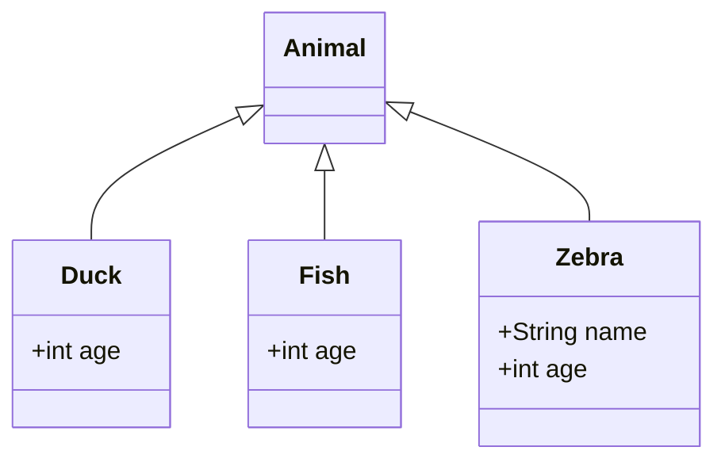
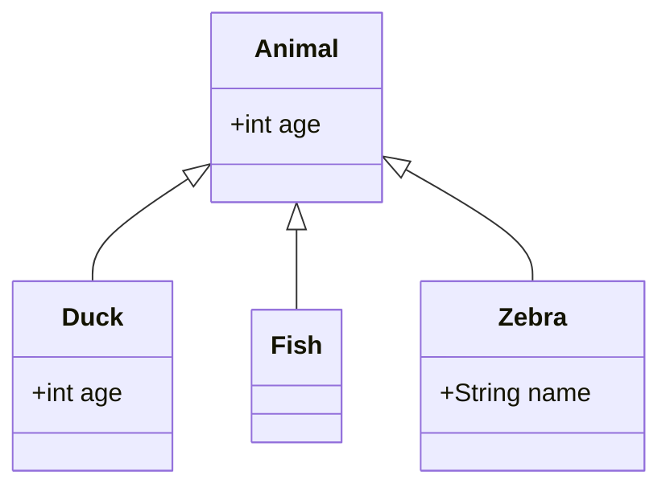
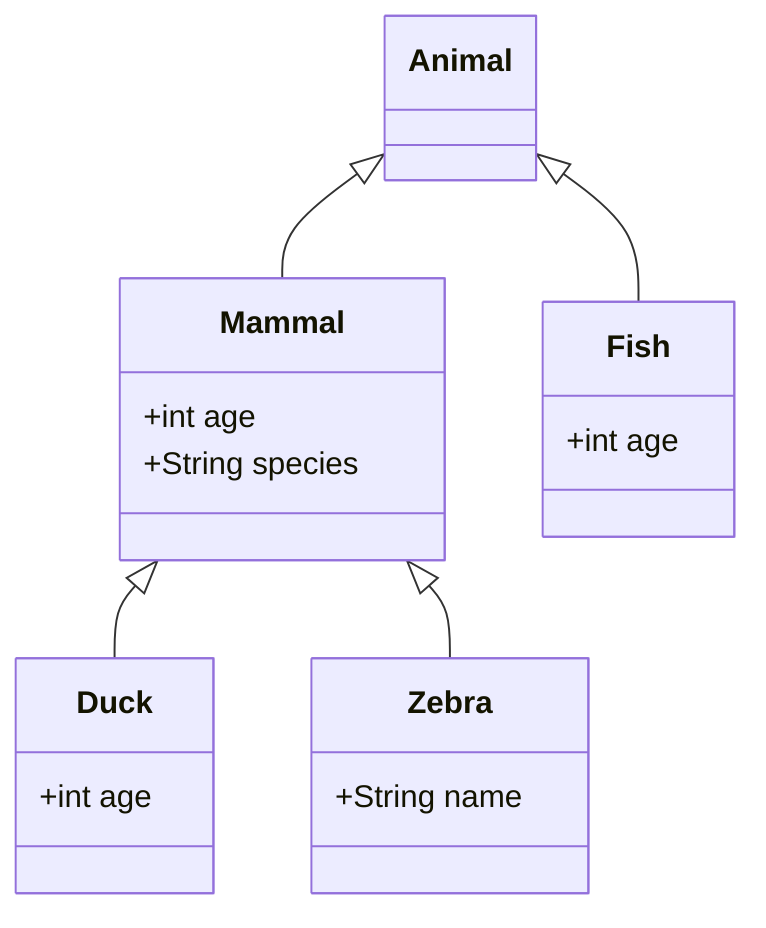
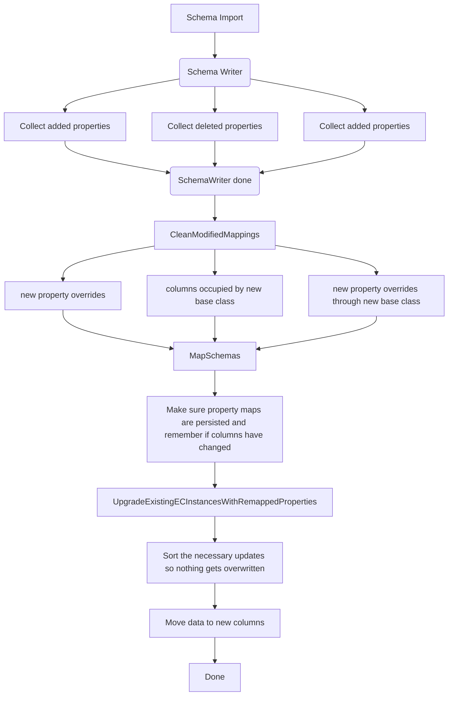

# Scope
This document describes transformations that happen during schema import.
The diagrams rely on mermaid. An extension can be used to preview these in vscode:
VS Marketplace Link: https://marketplace.visualstudio.com/items?itemName=bierner.markdown-mermaid

# Remapping properties
This area has already seen many iterations. The basic idea is, we import a schema which makes a valid change which requires us to re-map an existing property to a different column.

### Example schema updates:

#### Original schema

Animal is using shared columns.
`age` is mapped to *column1* for `Duck` and `Fish`, and to *column2* for `Zebra`.

#### "Move property up scenario":


Now, *age* is coming from `Animal`, turning all derived definitions of the property into overrides. Those overrides can be deleted, which in this example is done on `Fish` and `Zebra`. The deletion and moving can happen within the same schema import or spanning multiple ones.

`age` is now mapped to *column2* and `name` is mapped to *column1*
This requires us to move the instance data for classes `Duck` and `Fish` from *column1* to *column2*.

#### "Put New Class into the hierarchy scenario":

There are two variations of this.
- `Mammal` already existed before, meaning its properties are already assigned to columns. In this case we need to remap all properties in derived classes which occupy the same column as the `Mammal` properties
- `Mammal` is inserted as a class and put into the hierarchy at the same time. In this case we map its properties and only have to match the ones with identical names down the hierarchy.

Struct properties are somewhat special. They need to occupy consecutive columns in a single table, which means if one column of the struct overlaps with another property, we have to remap the entire struct property.

For adding a new property to a struct class, there is also some logic which will remap it and move the data. This was supported in a separate story and is currently not part of this document.

# Tables

## ec_PropertyPath
- One entry for each property column (structs have multiple rows)
-  Overwritten properties only appear once with their root class (the overrides do not have an own entry)
- Deleting a row removes all related rows in ec_PropertyMap

```
    +-----+----------------+--------------+
    | Id  | RootPropertyId | AccessString |
    +-----+----------------+--------------+
    | 139 |            175 | f.c.a        |
    | 140 |            175 | f.c.b        |
    | 142 |            176 | q            |
    +-----+----------------+--------------+
```

## ec_PropertyMap
- Defines a column for one propertyPath-ECClass combination
-  When using shared columns, the ColumnId for the same PropertyPathId appears to always be the same
unless the property is from a mixin.
- The PropertyMap seems to reflect the full derived classes structure, meaning each derived class will have its own entry. **Currently this is not guaranteed, as it breaks in some scenarios**

```
    +-----+---------+----------------+----------+
    | Id  | ClassId | PropertyPathId | ColumnId |
    +-----+---------+----------------+----------+
    | 325 |      73 |            139 |      316 |
    | 326 |      73 |            140 |      317 |
    +-----+---------+----------------+----------+
```

## Helpful query to diagnose properties mapped to shared columns

```sql
    SELECT s.Name schemaName, cl.Id as [classid], cl.Name className, p.Id propertyId, p.Name as PropertyName, p.Kind as Kind,
        pp.AccessString, pp.Id as PropertyPathId, t.Name tableName, c.Name columnName
        FROM [ec_PropertyMap] [pm]
        JOIN [ec_Column] [c] ON [c].[Id] = [pm].[ColumnId]
        JOIN [ec_Table] [t] ON [t].[Id] = [c].[TableId]
        JOIN [ec_Class] [cl] ON [cl].[Id] = [pm].[ClassId]
        JOIN [ec_PropertyPath] [pp] ON [pp].[Id] = [pm].[PropertyPathId]
        JOIN [ec_Schema] [s] ON [cl].[SchemaId] = [s].[Id]
        JOIN ec_Property [p] ON [pp].RootPropertyId = [p].[Id]
        where s.Name = "TestSchema" and c.ColumnKind = 4
        ORDER BY cl.Id, p.Id
```

Example output:
```
        +------------+---------+-----------+------------+--------------+------+--------------+--------------+-----------------------+------------+
        | schemaName | classId | className | propertyId | PropertyName | Kind | AccessString | PropertyPath |       tableName       | columnName |
        +------------+---------+-----------+------------+--------------+------+--------------+--------------+-----------------------+------------+
        | TestSchema |      73 | Building  |        171 | A            |    0 | A            |          139 | ts_GeometricElement3d | js2        |
        | TestSchema |      77 | B         |        175 | f            |    1 | f.c.a        |          140 | ts_GeometricElement3d | js3        |
        +------------+---------+-----------+------------+--------------+------+--------------+--------------+-----------------------+------------+

```

# Current implementation

Remapping happens in several stages, the logic is mostly encapsulated in `RemapManager.h/cpp`
  1. Collect information needed to do the remapping. This happens exclusively in `SchemaWriter.cpp`. We collect
      - added properties
      - deleted properties (so we can move their data)
      - New base classes
  2. After SchemaWriter, we cleanup ec_PropertyMap and ec_PropertyPath based in the information we collected. This happens in `RemapManager::CleanModifiedMappings()`. We store information about each cleaned property map in a `CleanedMappingInfo` struct, held in a map grouped by class id, so we can handle each class separately later.
  3. MapSchemas() regenerates/creates all missing mappings
  4. When schema maps are saved we need to make sure, the property maps we deleted previously get persisted. The automatic logic does not detect missing rows in the table `RemapManager::RestoreAndProcessCleanedPropertyMaps()`. In this step since we already obtain the PropertyMaps, we remember the new columns for our cleaned maps, if they changed.
  5. Next for each class which needs to move data, we order all of the necessary updates, so they do not overwrite existing data. This happens in `RemapManager::UpgradeExistingECInstancesWithRemappedProperties()`.

  Step 5 is dangerous as we would overwirte existing data if the sorting doesn't work properly.
  For example imagine we move column ps1 to ps2 and ps2 to ps3. The second statement has to be run before the first, or we will loose the data stored in ps2.
  It's also possible that we will hit a circular update, where two or more columns swap places, we support this, but only if everything happens within the same table. For moving across a table we'd have to use a temporary table or in-memory storage to hold the data of one column.

## The steps above as a chart:

