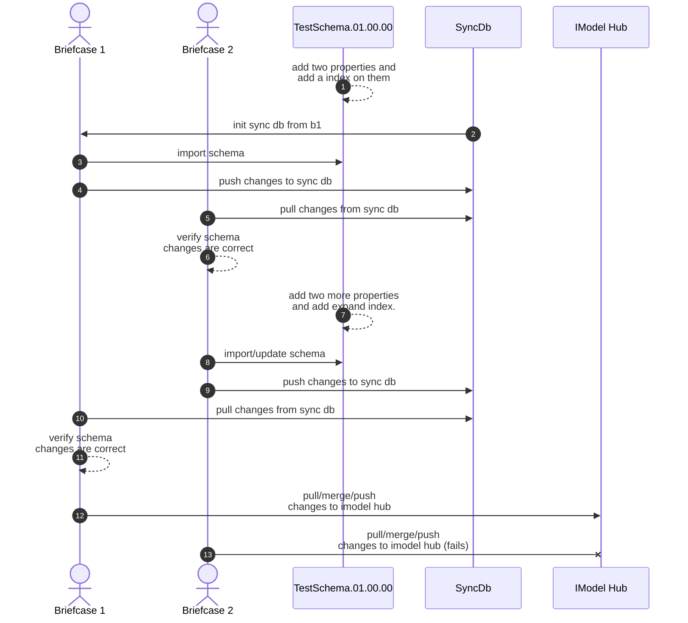
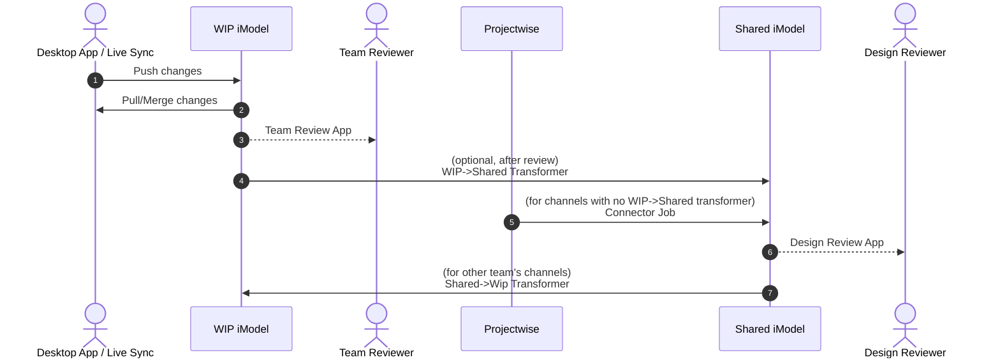

# No lock schema synchronization across multiple briefcases

No lock does not mean lock free. It just mean that briefcases can make changes to schema without requiring them to push there changes.

## Workflow test

## IModel edit workflow

